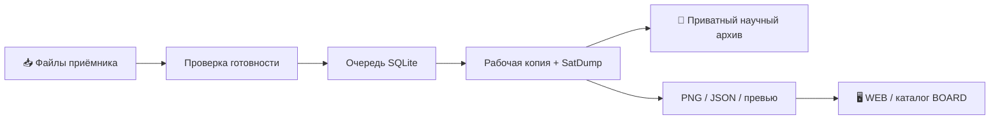

<div align="center">

# 🛰️ SatDump · Astra

**От принятого файла — к цветосинтезу, научному паспорту и продукции для BOARD**

SatDump 1.2.2 · автономная станция обработки · сервер продукции и API настроек

[](https://github.com/f2re/SatDump/actions/workflows/station-astra16.yml?query=branch%3Arelease%2F1.2.2)
[](https://github.com/f2re/SatDump/actions/workflows/presentation-1.2.2.yml?query=branch%3Arelease%2F1.2.2)
[](https://github.com/f2re/SatDump/actions/workflows/documentation.yml?query=branch%3Arelease%2F1.2.2)

[](https://github.com/f2re/SatDump/tree/release/1.2.2)
[](LICENSE)
[](https://github.com/f2re/SatDump/releases/tag/v1.2.2-astra16-station.13)

[**🚀 Установка BOARD**](docs/ru/station/BOARD_INFRASTRUCTURE.md) · [**📚 Справочник**](docs/ru/station/README.md) · [**📦 Выбор пакета**](docs/ru/RELEASES.md) · [**🛠️ Диагностика**](docs/ru/station/TROUBLESHOOTING.md)

</div>

> [!IMPORTANT]
> **Опубликован [Station / BOARD 13](https://github.com/f2re/SatDump/releases/tag/v1.2.2-astra16-station.13)** — полный бинарный предварительный инженерный выпуск для Astra 1.6 x86_64. [Проверки готового архива](https://github.com/f2re/SatDump/actions/runs/34356459004) прошли: офлайн-пакет, настоящие службы systemd, WEB/API, nginx, повторная установка и откат. Физическая Astra, её мандатные политики, радиозапись и перезагрузка ОС требуют отдельной приёмки.
>
> **Astra 1.6 Station и Astra 1.7 Desktop — разные продукты.** Архив **Source code** не является установочным пакетом. Новый дизайн и новый веб-интерфейс BOARD не входят в этот этап: сервер и API готовы, оформление подключается отдельно.

## 🧭 Выберите задачу

| Мне нужно | Куда перейти | Что получится |
|---|---|---|
| Установить обработчик, WEB и API на Astra 1.6 | [Мастер установки BOARD](docs/ru/station/BOARD_INFRASTRUCTURE.md) | Три службы systemd, каталог продукции и постоянная очередь |
| Работать с графическим SatDump на Astra 1.7 | [Пакет Astra 1.7](docs/ru/ASTRA17_BUNDLE.md) | Отдельная переносимая Desktop-сборка |
| Подключить папку приёмника | [Входы и маркеры готовности](docs/ru/station/INPUTS.md) | Автоматическое обнаружение завершённых файлов |
| Настроить синтез и подписи | [Продукты](docs/ru/station/PRODUCTS.md), [управляющий API](docs/ru/station/BOARD_INFRASTRUCTURE.md) | Реальные пресеты SatDump, полные и компактные PNG/JSON |
| Подключить готовое оформление BOARD | [Инфраструктура BOARD](docs/ru/station/BOARD_INFRASTRUCTURE.md) | Размещение своей статической сборки через ui-deploy |
| Собрать, выпустить или развернуть пакет | [Сборка](docs/ru/station/BUILD_RELEASE.md), [сопровождение](docs/ru/station/RELEASE_MAINTENANCE.md) | Проверяемый пакет и управляемая установка |
| Разобраться с ошибкой | [Диагностика](docs/ru/station/TROUBLESHOOTING.md) | Проверки от входного каталога до WEB |

## ✨ Что входит

**Обработка.** Штатный SatDump декодирует запись или повторно обрабатывает сохранённые `product.cbor` с каналами. Калибровку, выражения RGB, LUT, геометрию и научные легенды выполняет движок, а не веб-сервер.

**Автоматизация.** Обработчик отслеживает каталоги, проверяет завершённость передачи, ведёт очередь SQLite и журнал каждого задания. Обработка идёт на рабочей копии. Готовые материалы публикуются атомарно, в том числе между разными монтированиями systemd, без отключения защиты службы.

**BOARD.** Сервер отдаёт полные и компактные presentation PNG, исходные JSON-паспорта, превью и миниатюры. Каталог доступен через `/api/v1/board`. Фильтры видимости не вызывают научный пересчёт. До подключения вашей статической сборки `/` возвращает JSON, а не новый интерфейс. Прежние файлы галереи сохранены в исходниках, но не подменяют будущий дизайн BOARD.

**Настройки.** Отдельный авторизованный loopback API предоставляет конфигурацию, реальные возможности движка, проверку изменений и сохранение с контролем ревизий. Обработчик применяет изменения между заданиями; потенциальный пересчёт требует подтверждения. Приватная очередь, токен и настройки недоступны веб-пользователю.

**Эксплуатация.** Цветной интерактивный Bash-мастер и режим без вопросов устанавливают WEB вместе с обработчиком и API. Пакет содержит отдельное окружение Python/Pillow. На целевой станции не нужны Docker, Node.js, pip или компилятор. nginx необязателен: используется только уже установленный пакет ОС, с собственной конфигурацией. Код, настройки и наблюдения хранятся раздельно.



Текстовый маршрут: **вход → готовность → очередь → обработка → архив + публикация → WEB**. [Архитектура](docs/ru/station/DATAFLOW.md) · [Контракты BOARD](docs/ru/station/BOARD_INFRASTRUCTURE.md).

## 📦 Что скачивать

| Вариант | Отличительный признак | Сайт и обработчик |
|---|---|---|
| Astra 1.6 Station / BOARD | `astra16-station-…-x86_64.tar.gz` | WEB, обработчик и API; оформление отдельно |
| Astra 1.6, только движок | `presentation-…-glibc224-x86_64.tar.gz` | Нет |
| Astra 1.7 Desktop | `astra17-desktop-glibc228-x86_64.tar.gz` | Нет станции; это Desktop/CLI |
| GitHub Source code | Автоматические ZIP / tar.gz исходников | Не готовая установка |

**[Скачать Station / BOARD 13](https://github.com/f2re/SatDump/releases/tag/v1.2.2-astra16-station.13)**: архив, `.sha256` и `STATION-ACCEPTANCE.json`. Ревизия Station: `91b7c765eb9bcf3632dccef6ae08443724e5b7b0`. Происхождение неизменённых нативных компонентов зафиксировано отдельно в `component_provenance` манифеста.

Отдельный Desktop-релиз: [v1.2.2-astra17-presentation](https://github.com/f2re/SatDump/releases/tag/v1.2.2-astra17-presentation). Состав, контрольные суммы, результаты испытаний и исторические попытки: [матрица релизов](docs/ru/RELEASES.md).

## 🚀 Начать с готового пакета

**Где выполнять:** на целевой Astra 1.6, в каталоге доверенного скачанного архива и его файла `.sha256`.

```bash
ARCHIVE='satdump-1.2.2-astra16-station-91b7c765eb9b-x86_64.tar.gz'
sha256sum -c "$ARCHIVE.sha256"
tar -xzf "$ARCHIVE"
cd "${ARCHIVE%.tar.gz}"
sudo ./install.sh
```

Мастер: каталог → IPv4 → порт → сервер → источник → тип входа → итоговый план. Enter принимает значение, `b` возвращает назад, `q` отменяет. Цвет и анимацию можно отключить; сценарии используют `--non-interactive` или `--yes`.

После успешной установки WEB доступен по адресу `http://127.0.0.1:8090/`, каталог — `/api/v1/board`. Для доступа из доверенной ЛВС адрес задаётся явно:

```bash
sudo ./install.sh --non-interactive --listen 0.0.0.0 --port 8090
```

API управления остаётся на `127.0.0.1:8091`; внешний bind WEB не открывает управление в ЛВС. Сохранённые файлы приёмника должны иметь настроенный признак завершения передачи. Руководство непосредственно в архиве — `BOARD_INFRASTRUCTURE.ru.md`.

> [!WARNING]
> WEB предназначен для локальной станции или доверенной ЛВС, не для прямой публикации в интернете. Установщик не открывает межсетевой экран, не меняет мандатные политики Astra и не настраивает публичный TLS-доступ. [Ограничения и права](docs/ru/station/BOARD_INFRASTRUCTURE.md). При переносе существующего `data_dir` требуется отдельная административная миграция, а не простое изменение через API.

## ⌨️ Полезные команды

| Где | Команда | Назначение |
|---|---|---|
| Исходный репозиторий | `./station.sh build --jobs 2` | Собрать движок, окружение и полный пакет |
| Исходный репозиторий | `./build.sh` | Прежний сборщик только движка |
| Готовый пакет | `sudo ./install.sh --dry-run` | План, не полный тест совместимости |
| Установленная станция | `sudo satdump-station doctor` | Диагностика конфигурации, путей и окружения |
| Установленная станция | `sudo satdump-station status` | Последние задания и ошибки |
| Установленная станция | `sudo satdump-station logs` | Журналы служб |
| Установленная станция | `sudo satdump-station restart` | Перезапустить службы |
| Установленная станция | `sudo satdump-station rollback` | Вернуть код, настройки и службы; не данные и очередь |
| Установленная станция | `sudo satdump-station ui-deploy /path/to/board` | Подключить свою готовую сборку сайта |

[Основной справочник команд](docs/ru/station/REFERENCE.md) · [Расширения BOARD и API](docs/ru/station/BOARD_INFRASTRUCTURE.md).

## 🗂️ Карта репозитория

| Путь | Содержимое |
|---|---|
| [`station.sh`](station.sh), [`install.sh`](install.sh) | Точки входа станции |
| [`services/station/`](services/station/README.md) | Обработчик, очередь, WEB, API и адаптер BOARD |
| [`config/station/`](config/station/README.md) | Шаблоны и контракты; не активные настройки |
| [`scripts/station/`](scripts/station/README.md) | Сборка, установка, SSH, реальная приёмка пакета |
| [`scripts/astra/`](scripts/astra/README.md) | Сборщики движка |
| [`src-cli/`](src-cli/), [`src-core/`](src-core/), [`plugins/`](plugins/) | Исходники SatDump; структура CMake сохранена |
| [`docs/`](docs/README.md) | Руководства и научная документация |
| [`tests/station/`](tests/station/README.md) | Контрактные и регрессионные тесты; не проверка радиоприёма |
| `build/` | Промежуточные результаты |
| `dist/station/` | Результат упаковки полного комплекта |

## 🔎 Что важно понимать заранее

Готовый PNG не содержит автоматически восстанавливаемых спектральных каналов. Для пересчёта нужны каналы или корректно описанная запись. `mtime` файла не равен времени наблюдения. `north_up` — запрос ориентации, а подтверждение находится в паспорте. `max_items` ограничивает ленту, **не удаляет архив**. Скрытие карточки не запрещает доступ к прежнему URL. Офлайн-установка не означает первичную сборку без интернета. [Ограничения](docs/ru/station/TROUBLESHOOTING.md).

## 🤝 Разработка и сопровождение

[Как внести изменение](CONTRIBUTING.md) · [История](CHANGELOG.md) · [Стиль документации](docs/STYLE_GUIDE.md) · [Сообщить об ошибке](https://github.com/f2re/SatDump/issues)

Форк основан на SatDump; лицензия — [GPL-3.0](LICENSE). Уведомления зависимостей среды исполнения входят в `runtime/licenses/`. Не включайте в публичные обращения закрытые записи, SSH-ключи, внутренние адреса и сведения ограниченного доступа.
