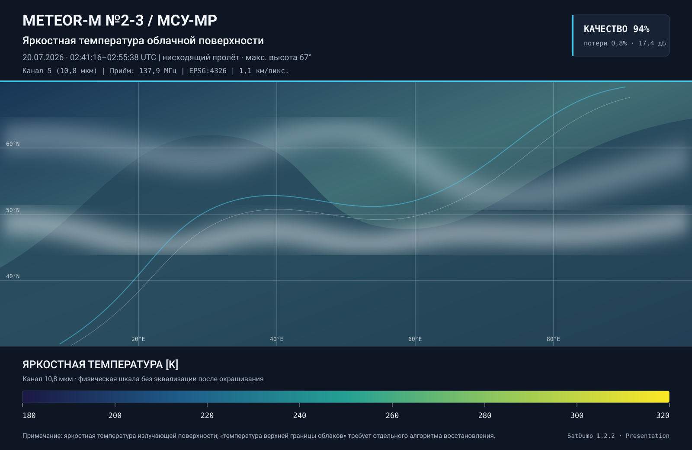

<div align="center">

# 🛰️ SatDump 1.2.2 Presentation

**Декодирование спутниковых данных, геопривязанные карты и готовые к публикации метеорологические изображения**




Русскоязычная ветка SatDump 1.2.2 для полного цикла обработки спутниковых данных на рабочих станциях и автономных серверах, включая Astra Linux.

[Возможности](#возможности) · [Два макета](#два-макета) · [Геопривязка](#геопривязка-города-и-контуры) · [Сборка одной командой](#сборка-одной-командой) · [Установка](#быстрый-старт) · [Настройка](#настройка-presentation-mode) · [Документация](#документация)

</div>

> [!IMPORTANT]
> Информационные плашки создаются только в отдельных `*_annotated_*.png`. Исходный композит сохраняется до оформления. Картографические слои наносятся только при наличии реальной проекционной или навигационной конфигурации — координаты городов не вычисляются «по картинке».

## Назначение

```text
IQ / сырые кадры
  → демодуляция и декодирование
  → калибровка каналов и построение композитов
  → геометрическая коррекция
  → географическая проекция
  → границы, береговая линия и города
  → Minimal / Presentation PNG
  → JSON-паспорт продукта
```

Основная линия разработки — **`release/1.2.2`**. Она основана на официальном SatDump 1.2.2 и развивается отдельно от SatDump 2.x.

## Возможности

| Блок | Что реализовано |
|---|---|
| Декодирование | Штатные pipelines SatDump для спутниковых приборов и каналов |
| Научные продукты | Каналы, калиброванные величины, RGB/LUT/Lua/C++-композиты |
| Геометрия | Геометрическая коррекция, репроекция, проверка «север сверху» |
| Карта | Автоматические государственные границы, береговая линия и города |
| Minimal | Одна тонкая верхняя строка с ключевой информацией о снимке |
| Presentation | Заголовок, паспорт пролёта, качество, легенда и пояснения |
| Адаптивность | Читаемый шрифт на малых, HD, 4K и крупных научных растрах |
| Паспорт | JSON sidecar схемы `satdump.presentation/2` |
| Astra Linux | Сценарии сборки, проверки и офлайн-бандлы для 1.6/1.7 |
| Контроль | Smoke-тесты ориентации, размеров, малых кадров и одного входного канала |

## Два макета

### Minimal

Minimal предназначен для оперативных каталогов, рассылок и большого потока снимков.

- только одна тонкая полоса сверху;
- одна строка и один кегль;
- спутник, прибор, продукт, дата/время, каналы и проекция;
- реальное измерение ширины через `TextDrawer::measure_text()`;
- последовательное удаление второстепенных полей, если строка не помещается;
- уменьшение шрифта только после сокращения состава полей;
- UTF-8-безопасное многоточие как последний fallback;
- нижний footer и подробная легенда отсутствуют.

Пример строки:

```text
METEOR-M №2-3 / МСУ-МР · Ночная микрофизика · 31.08.2026 02:41–02:55 UTC · Каналы: 3, 4, 5 · Проекция: equirec
```

### Presentation

Presentation предназначен для отчётов, метеорологических сводок и публикаций.

- крупный идентификатор аппарата и прибора;
- название продукта;
- время и направление пролёта;
- параметры приёма и качества;
- непрерывная, категориальная или компонентная легенда;
- пояснения для LUT, Lua и C++-алгоритмов;
- отдельный JSON-паспорт;
- адаптивная типографика для портретных, квадратных и альбомных кадров.

### Масштабирование малых и крупных снимков

Малые изображения от оборудования с низким разрешением увеличиваются **до оформления**, а не окружаются непропорционально крупными плашками.

Целевые размеры:

- короткая сторона — не менее `720 px`;
- длинная сторона — не менее `1280 px`;
- увеличение — не более `8×`;
- создаваемая сторона — не более `8192 px`.

Увеличение выполняется билинейно. Большие исходные растры не уменьшаются: для них вместе с разрешением растёт кегль плашек, чтобы подписи оставались читаемыми после показа «вписать в экран».

## Геопривязка, города и контуры

Когда presentation mode включён и продукт содержит `proj_cfg`, SatDump автоматически добавляет:

- государственные границы;
- береговую линию;
- столицы и региональные центры;
- подписи городов с размером, рассчитанным от ширины изображения.

Размер городских подписей вычисляется как `width / 64` и ограничивается диапазоном `16–96 px`.

| Ситуация | Поведение |
|---|---|
| Полоса имеет навигационную модель | Контуры и города наносятся через исходную функцию проекции |
| Выполняется географическая репроекция | Слои наносятся после репроекции, поэтому подписи не растягиваются |
| Создаётся одиночный проецированный канал | Он переводится в RGB с сохранением `proj_cfg`, затем получает карту |
| Есть геометрически исправленная полоса | Для слоя используется скорректированное соответствие пикселей |
| Геоданных нет | Снимок сохраняется, но карта не выдумывается; в журнал пишется предупреждение |

Пример диагностического сообщения:

```text
Presentation geographic context was requested for <product>,
but this product has no projection/geolocation configuration
```

Для такого источника необходимо исправить декодер или импорт: передать `proj_cfg`, GCP либо эквивалентную модель геолокации. Только после этого можно достоверно разместить города и контуры.

## Почему цветовой продукт может иметь один входной канал

Количество каналов выходного PNG и количество физических входов — разные характеристики.

RGB-изображение может быть построено из одного канала, если:

- яркость скопирована в `R`, `G` и `B`;
- к одному каналу применена цветовая LUT;
- цвет сформирован Lua- или C++-алгоритмом;
- preset описывает один выходной компонент, внутри которого скрыта дополнительная обработка.

Раньше такой результат автоматически назывался многоканальным RGB-композитом. Теперь при одном обнаруженном физическом входе используется корректное описание:

```text
Цветовое представление одного исходного канала
```

В легенде отдельно указывается, что RGB-выход не доказывает наличие трёх спектральных каналов. Если Lua/C++-preset фактически использует несколько источников, но их невозможно извлечь из выражения автоматически, компоненты следует описать явно:

```json
{
  "presentation": {
    "legend": {
      "kind": "composite",
      "title": "Состав цветового продукта",
      "components": [
        {
          "component": "R",
          "channel": "5",
          "quantity": "яркостная температура",
          "formula": "T(12.0 µm) - T(10.8 µm)"
        },
        {
          "component": "G",
          "channel": "4",
          "quantity": "яркостная температура"
        },
        {
          "component": "B",
          "channel": "3",
          "quantity": "отражательная способность"
        }
      ]
    }
  }
}
```

## Форматы вывода

Для обычного композита могут появиться следующие файлы:

| Файл | Назначение |
|---|---|
| `<product>.png` / `<product>.tif` | исходный продукт SatDump |
| `<product>_map.png` | полоса с границами, береговой линией и городами |
| `rgb_<product>_projected.png` | географически спроецированная карта |
| `<product>_annotated_minimal.png` | одна компактная верхняя строка |
| `<product>_annotated_minimal.json` | паспорт Minimal |
| `<product>_annotated_presentation.png` | полное презентационное оформление |
| `<product>_annotated_presentation.json` | паспорт Presentation |

Совместимый файл `<product>_annotated.png` включается отдельно через `legacy_alias`.

## Быстрый старт

### 1. Клонирование

```bash
git clone --branch release/1.2.2 https://github.com/f2re/SatDump.git
cd SatDump
```

### 2. Сборка одной командой

На Astra Linux достаточно запустить корневой сценарий:

```bash
./build.sh
```

Он установит необходимые хостовые зависимости, подготовит изолированное
окружение Debian Stretch/glibc 2.24 и соберёт полный переносимый CLI-бандл
`reference` для Astra Linux 1.6. GUI в этот профиль не входит.

Архив будет создан в `dist/astra-portable/`. Native GUI по-прежнему доступен
явно:

```bash
./build.sh --mode native --profile desktop
```

Для уменьшенного Meteor/NOAA/APT-бандла:

```bash
./build.sh --profile meteor
```

Повторная сборка без установки пакетов:

```bash
./build.sh --skip-deps
```

Дополнительные параметры portable-профиля (`--clean-rootfs`, `--jobs N` и другие)
передаются штатному сценарию. Для native-параметров укажите `--mode native`.

> [!WARNING]
> Не запускайте `build.sh` через `sudo`: сценарий сам повышает права только для
> APT. Сборка и локальные зависимости должны принадлежать обычному пользователю.

### 3. Ручная сборка и проверка Astra Linux

Если нужен полный контроль над отдельными этапами:

```bash
cat /etc/astra/build_version
bash scripts/astra/check-system.sh --strict
```

#### Серверная сборка без GUI

```bash
bash scripts/astra/install-deps.sh \
  --profile headless \
  --bootstrap-missing

bash scripts/astra/build.sh \
  --profile headless \
  --clean \
  --install

bash scripts/astra/run.sh -- version
```

#### Рабочая станция с GUI и RTL-SDR

```bash
bash scripts/astra/install-deps.sh \
  --profile desktop \
  --bootstrap-missing

bash scripts/astra/build.sh \
  --profile desktop \
  --sdr rtl \
  --clean \
  --install
```

> [!WARNING]
> Не запускайте весь `install-deps.sh` через `sudo`. Сценарий сам повышает права только для APT. Локальные CMake и библиотеки должны принадлежать обычному пользователю.

### 4. Офлайн-бандл

```bash
bash scripts/build-and-bundle.sh --profile headless
```

Ожидаемый архив:

```text
dist/satdump-1.2.2-offline-x86_64.tar.gz
```

Установка на машине без сети:

```bash
tar -xzf satdump-1.2.2-offline-x86_64.tar.gz
cd satdump-1.2.2-offline-x86_64
./install.sh
```

## Обработка данных

### Файл baseband

Общая форма:

```text
satdump <pipeline_id> <input_level> <input_file> <output_directory> [параметры]
```

Пример Meteor-M LRPT:

```bash
bash scripts/astra/run.sh -- \
  meteor_m2x_lrpt \
  baseband \
  /data/input/meteor_pass.cs16 \
  /data/output/meteor_pass \
  --samplerate 240000 \
  --baseband_format cs16
```

Pipeline, частота дискретизации и формат должны соответствовать реальной записи.

### Live-приём

Проверка SDR:

```bash
bash scripts/astra/run.sh -- sdr_probe
```

Пример:

```bash
bash scripts/astra/run.sh -- \
  live meteor_m2x_lrpt \
  /data/output/live-meteor \
  --source rtlsdr \
  --samplerate 240000 \
  --frequency 137900000 \
  --gain 35 \
  --timeout 900
```

## Настройка presentation mode

Настройка задаётся внутри preset композита:

```json
{
  "presentation": {
    "enabled": true,
    "outputs": {
      "minimal": true,
      "presentation": true,
      "legacy_alias": false
    },
    "orientation": {
      "mode": "auto",
      "north_up": true
    },
    "minimal": {
      "theme": {
        "panel": "#101820",
        "text": "#F3F7FB",
        "accent": "#55C7E8"
      }
    },
    "editorial": {
      "branding": "Спутниковая метеорология",
      "theme": {
        "panel": "#0E1624",
        "panel_secondary": "#172235",
        "text": "#F3F7FB",
        "muted_text": "#AAB8C8",
        "accent": "#4EC7E8"
      }
    }
  }
}
```

Режимы ориентации:

```text
auto | keep | flip_vertical | flip_horizontal | rotate_180
```

При `auto` порядок определения следующий:

1. проекция фактического выходного растра;
2. GCP, TLE и временные метки;
3. направление пролёта;
4. сохранение исходной ориентации с диагностикой недостатка данных.

## Легенды

Поддерживаются четыре типа:

| `kind` | Применение |
|---|---|
| `none` | легенда не требуется |
| `continuous` | температура, альбедо, радианс и другие непрерывные величины |
| `categorical` | классы облачности, маски и дискретные категории |
| `composite` | RGB/LUT/Lua/C++-продукты и их входные компоненты |

Пример непрерывной шкалы:

```json
{
  "presentation": {
    "title": "Яркостная температура облачной поверхности",
    "legend": {
      "kind": "continuous",
      "title": "Яркостная температура",
      "unit": "K",
      "min": 180,
      "max": 320,
      "ticks": [180, 200, 220, 240, 260, 280, 300, 320],
      "colors": [
        "#1B1844",
        "#1E5E8B",
        "#24A093",
        "#96C959",
        "#FCE725"
      ]
    }
  }
}
```

Цветовая шкала должна соответствовать той же LUT и тем же пределам, которые применяются при окрашивании самого продукта.

## Проверка renderer

Тестовый бинарник проверяет:

- портретный и альбомный кадр;
- Minimal и Presentation;
- непрерывную, категориальную и компонентную легенду;
- входной кадр `320×180`;
- увеличение малого растра;
- ограничение высоты Minimal-полосы;
- цветовой продукт из одного физического канала;
- вертикальное и горизонтальное отражение;
- поворот на `180°`;
- восходящий и нисходящий пролёт;
- перевёрнутую пользовательскую проекцию.

Эталонные файлы:

```text
continuous_editorial_landscape.png
continuous_minimal_landscape.png
categorical_editorial_landscape.png
composite_editorial_landscape.png
composite_minimal_landscape.png
continuous_editorial_portrait.png
continuous_minimal_portrait.png
small_receiver_minimal.png
small_receiver_editorial.png
single_channel_color_editorial.png
```

Каталог результатов:

```text
build/astra-<версия>-<профиль>/presentation-test-output/
```

## Astra Linux

### Astra Linux 1.6

Обычно требуются main/update и dev-репозитории **точного установленного обновления**, GCC/G++ с C++17 и локальный CMake, если системная версия слишком старая.

```bash
bash scripts/astra/bootstrap-cmake.sh
```

Локальный CMake устанавливается в пользовательский каталог и не заменяет `/usr/bin/cmake`.

### Astra Linux 1.7

GCC 8 с C++17 обычно доступен штатно. Сценарии всё равно выполняют пробную компиляцию и при необходимости подключают локальные инструменты.

Профили сборки:

| Профиль | Назначение |
|---|---|
| `headless` | CLI, Meteor/NOAA/APT, серверная и пакетная обработка |
| `desktop` | GUI, OpenGL, звук и выбранный SDR |
| `full` | расширенный стенд разработки |

SDR-профили:

```text
none | rtl | common | all
```

## Научная корректность

- Одноканальный ИК-продукт по умолчанию называется **яркостной температурой**.
- «Температура верхней границы облаков» допустима только при наличии отдельного физически обоснованного retrieval-алгоритма.
- Тип облачности — категориальный многоканальный продукт, а не непрерывная шкала.
- Радиочастота приёма и спектральный диапазон прибора указываются раздельно.
- Неизвестные параметры не подставляются по названию спутника.
- RGB-файл сам по себе не означает, что использованы три спектральных канала.

## Документация

- [Индекс русской документации](docs/ru/README.md)
- [Установка в Astra Linux](docs/ru/INSTALL_ASTRA.md)
- [Сборка](docs/ru/BUILD.md)
- [Проверка Astra Linux](docs/ru/ASTRA_VALIDATION.md)
- [Запуск и обработка](docs/ru/RUN.md)
- [Настройка](docs/ru/CONFIGURATION.md)
- [Presentation mode](docs/ru/PRESENTATION.md)
- [Два макета и ориентация](docs/ru/PRESENTATION_LAYOUTS.md)
- [Развёртывание](docs/ru/DEPLOYMENT.md)
- [Диагностика](docs/ru/TROUBLESHOOTING.md)

## Разработка

Перед публикацией изменений renderer:

```bash
bash scripts/astra/build.sh --profile headless --clean
```

Затем требуется визуально проверить малый, портретный и альбомный эталоны, а также реальные восходящий и нисходящий пролёты.

Для защищённого контура сохраняйте:

- SHA коммита;
- `CMakeCache.txt`;
- журнал сборки;
- контрольную сумму установочного архива;
- точную версию Astra Linux целевой машины.

## Лицензия

Проект распространяется на условиях [GNU GPL v3](LICENSE).
