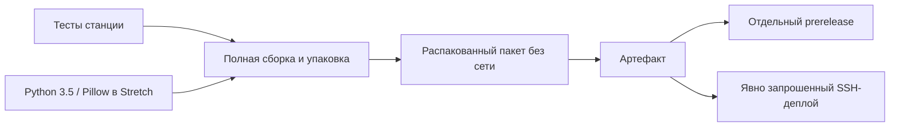

# 📦 08 · Сборка, релиз и управляемый автодеплой

[← Эксплуатация](OPERATIONS.md) · [Оглавление](README.md) · [Диагностика →](TROUBLESHOOTING.md)

## 1. Четыре разных действия

| Действие | Что получается | Нужен интернет |
|---|---|---|
| Сборка исходников | Исполняемый движок и окружение | Первичная подготовка — да |
| Упаковка | Версионный архив, манифест, SHA-256 | При готовых локальных компонентах — нет |
| Установка | Код, конфиги, пользователи, службы | На Astra для готового пакета — нет |
| Развёртывание | Передача пакета и удалённая установка | Нужен SSH-маршрут, не обязательно интернет у станции |

Офлайн-пакет не означает, что первичная сборка умеет работать без всех заранее загруженных исходников и зависимостей. Docker может использоваться в CI для тестовой среды; на рабочей станции он не требуется.

## 2. Сборка полного пакета

**Где:** доверенный Linux x86_64 с интернетом, root/sudo и инструментами `debootstrap`, `rsync`, `readelf`, `python3`, `git`, `chroot`. Для тестов также нужны Pillow и ShellCheck. Проект использует чистое закоммиченное дерево исходников.

```bash
git clone --branch release/1.2.2 --single-branch https://github.com/f2re/SatDump.git
cd SatDump
./station.sh help
./station.sh build --jobs 2
```

Команда проверяет наличие сборочных инструментов; **не является** универсальным установщиком всех зависимостей хоста. Референсный список подготовки CI находится в [workflow](../../../.github/workflows/station-astra16.yml). Первичная подготовка toolchain выполняется существующим portable-сборщиком.

| Параметр | По умолчанию | Смысл |
|---|---|---|
| `--jobs N` | `2` | Параллелизм компиляции, положительное целое |
| `--profile reference\|meteor` | `reference` | Набор плагинов, не оформление сайта |
| `--output-dir DIR` | `dist/station` | Результат упаковки |
| `--rootfs DIR` | `/var/lib/satdump-build/station-stretch-amd64` | Выделенный Debian Stretch chroot |

Не передавайте `station.sh build` параметры другого сборщика наугад: здесь нет общего `--skip-deps`. Для сборки **только движка** сохраняется прежний корневой `./build.sh`; для дополнительных режимов движка см. [Portable Astra](../PORTABLE_ASTRA.md) и [скрипты Astra](../../../scripts/astra/README.md).

## 3. Что проверяет упаковщик

Движок и отдельное окружение Python/Pillow подготавливаются на базе glibc 2.24. Упаковщик проверяет наличие launcher и `reprocess`, манифест движка, импорт нужных модулей Python, архитектуру ELF x86_64 и максимальные требования символов `GLIBC <= 2.24`. Системная glibc в пакет как замена ОС не устанавливается.

В архив попадают код, ресурсы, runtime, инструкции, конфигурационные образцы, тесты, `PACKAGE-MANIFEST.json` и полный `SHA256SUMS`. Имя включает часть Git SHA. Метаданные tar/gzip нормализуются через `SOURCE_DATE_EPOCH`.

> [!NOTE]
> Нормализованный архив не означает доказанную побитовую воспроизводимость всей цепочки: версии пакетов архивного APT и окружение сборки также имеют значение. Проверка ABI не заменяет испытания на конкретной Astra.

Для отдельной упаковки подготовленных компонентов нужен **реальный SHA собранных исходников**:

```bash
./station.sh pack \
  --engine /путь/к/готовому/glibc224-движку \
  --runtime /путь/к/подготовленному/python-runtime \
  --output /путь/к/новому/каталогу \
  --revision "$(git rev-parse HEAD)"
```

Эта команда корректна только когда компоненты действительно собраны из указанного коммита. Существующий каталог того же результата упаковщик не перезаписывает; используйте новый каталог, не удаляйте рабочие релизы вслепую.

## 4. GitHub Actions: цепочка допуска



Обычные push/PR запускают проверки в пределах фильтров workflow. Дорогая сборка, публикация и установка требуют явного запроса. PR не публикует и не развёртывает пакет. Независимый тест пакета использует Debian Stretch без сети; вариант установки `--no-start` в контейнере не проверяет настоящий systemd целевой Astra.

| Запрос | Действие |
|---|---|
| `[station-release]` в сообщении коммита | Сборка и отдельный предварительный релиз |
| `[station-deploy]` | Сборка и SSH-установка на настроенный хост |
| Оба маркера | Оба действия после допуска |
| Обычный push без маркеров | Проверки; автоматическая установка не выполняется |

Для гарантированного попадания под фильтр путей используйте файл-заявку:

```bash
git switch release/1.2.2
git pull --ff-only
printf '%s\n' "$(date -u +%Y-%m-%dT%H:%M:%SZ)" > config/station/release-request.txt
git add config/station/release-request.txt
git commit -m 'ci: request station package [station-release]'
git push origin HEAD:release/1.2.2
```

Пустой commit или изменение только файла вне фильтра может не запустить workflow. Новый push отменяет устаревший прогон в группе этой ветки. Поэтому не отправляйте косметические изменения поверх активной релизной сборки без необходимости.

`workflow_dispatch` описан в YAML: `build_offline`, `publish`, `deploy_astra16`. Для доступности ручного запуска GitHub требует workflow в default branch; наличие файла только в `release/1.2.2` само по себе не гарантирует кнопку. Менять default branch ради станции не требуется: используйте документированный push-запрос. [Правило GitHub](https://docs.github.com/en/actions/reference/workflows-and-actions/events-that-trigger-workflows#workflow_dispatch).

## 5. Релизы и доказательства

Теги станции имеют вид `v1.2.2-astra16-station.N`; `N` — номер workflow, не версия glibc. Уже существующий тег не заменяется. Исходники и документация ветки могут быть новее последнего бинарного архива.

При описании релиза укажите SHA, имя архива, checksum, результат каждого этапа, проверенные ОС и ограничения. Используйте [шаблон релиза](../../RELEASE_TEMPLATE.md) и [матрицу](../RELEASES.md). Если сборка упала, не создавайте заглушку под видом установочного архива.

## 6. Настроить автодеплой

В GitHub Environment `astra16-station`:

| Секрет | Содержимое |
|---|---|
| `ASTRA16_DEPLOY_TARGET` | Явный `user@host` |
| `ASTRA16_DEPLOY_KEY` | Ключ выделенного пользователя развёртывания |
| `ASTRA16_KNOWN_HOSTS` | Заранее проверенная запись ключа целевого SSH-сервера |

Учётная запись, её SSH-доступ и разрешённый `sudo -n` на установку настраиваются администратором. Установщик не создаёт пароли и не редактирует sudoers. Проверка host key не отключается. Не получайте «доверенный» ключ вслепую из того же непроверенного соединения.

По умолчанию runner — `ubuntu-22.04` на GitHub. В закрытой ЛВС задайте **репозиторную переменную** `ASTRA16_DEPLOY_RUNNERS` с метками заранее настроенного доверенного исполнителя, например:

```json
["self-hosted", "linux", "satdump-deploy"]
```

Runner должен иметь маршрут до Astra и сам поддерживаться GitHub Actions; он не обязан работать на старой Astra. Подключение runner не создаёт VPN автоматически. Ограничьте доступ к окружению и при необходимости настройте обязательное согласование.

## 7. Развёртывание вручную по SSH

**Где:** доверенная машина, имеющая SSH-маршрут до станции. Адрес примера заменяется реальным.

```bash
./station.sh deploy /путь/к/выбранному-пакету.tar.gz operator@192.0.2.10
```

Рядом обязателен `.sha256`. Проверяются checksum и безопасная структура архива, файлы передаются во временный каталог, на целевой стороне сумма проверяется повторно и вызывается тот же установщик. Первый запуск сайта остаётся локальным; доступ из ЛВС включается отдельно. При неудачной передаче/установке временные каталоги могут требовать ручного осмотра и очистки.

Без сетевого маршрута переносите этот же пакет на носителе. Это офлайн-установка, а не SSH-автодеплой.

**Основание:** [build.sh](../../../scripts/station/build.sh), [pack.py](../../../scripts/station/pack.py), [bundle-python.sh](../../../scripts/station/bundle-python.sh), [deploy.sh](../../../scripts/station/deploy.sh), [workflow](../../../.github/workflows/station-astra16.yml).

[← Эксплуатация](OPERATIONS.md) · [Оглавление](README.md) · [Диагностика →](TROUBLESHOOTING.md)
