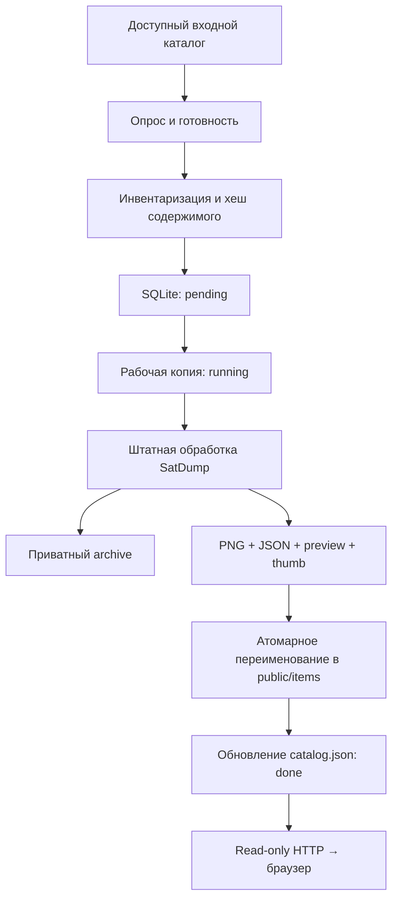
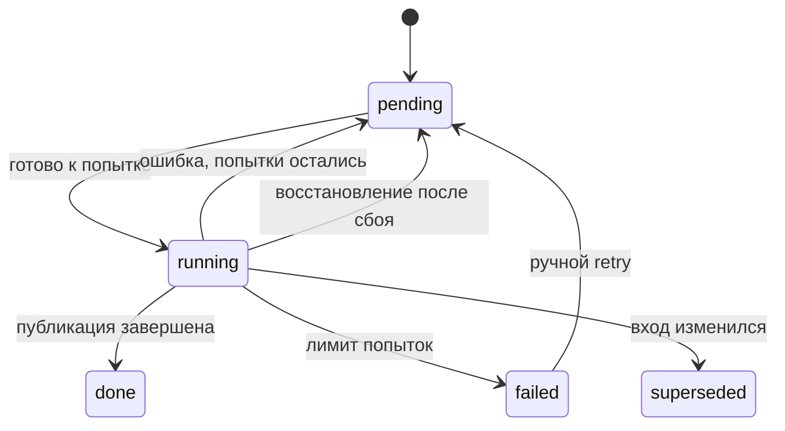

# 🧩 02 · Архитектура, очередь и каталоги

[← Установка](INSTALL.md) · [Оглавление](README.md) · [Источники →](INPUTS.md)

## 1. Границы системы

| Компонент | Отвечает за | Не отвечает за |
|---|---|---|
| Производитель входных файлов | Завершённые файлы, метаданные, маркеры готовности | Очередь публикации |
| Воркер | Обнаружение, проверку, рабочую копию, запуск SatDump, архив, публикацию | Самостоятельный приём SDR, монтирование сетевых дисков |
| SatDump | Декодирование, калибровку, цветосинтез, геометрию и оформление | Веб-интерфейс и долговременную очередь станции |
| Веб-служба | Чтение разрешённых материалов и выдачу HTTP | Администрирование, запись настроек, запуск заданий |
| Браузер | Фильтры, просмотр, презентацию | Пересчёт спектральных продуктов |
| Установщик | Проверку пакета, службы, пользователей, переключение кода | Настройку политик Astra, межсетевого экрана и источника приёмника |



Без Mermaid: **вход → очередь → рабочая копия → SatDump → архив и публикационный набор → каталог → HTTP**.

## 2. Три независимые области хранения

```text
/opt/satdump-station/                 КОД, владелец root
├── releases/<release_id>/
│   ├── engine/                      SatDump и его несистемные библиотеки
│   ├── runtime/                     отдельное окружение Python/Pillow
│   ├── services/station/            воркер и интерфейс
│   └── scripts/                     установщик и служебные сценарии
├── current -> releases/...
└── previous -> releases/...

/etc/satdump-station/                 КОНФИГУРАЦИЯ
├── station.json                     источник истины для воркера
├── processing.json                  дополнения к конфигурации движка
├── web.env                          адрес и порт сайта
└── *.example                        образцы из нового пакета

/var/lib/satdump-station/             ДАННЫЕ
├── inbox/images/                    готовые картинки
├── inbox/products/<pass>/           наборы каналов
├── inbox/meteor_iq/                 пример сырого входа
├── state/queue.sqlite3              постоянная очередь
├── state/worker.lock                блокировка процесса
├── work/<job_id>/                   рабочая копия, HOME и результаты
├── logs/<job_id>.log                журнал вызова SatDump
├── archive/<job_id>/                научные/исходные результаты
└── public/
    ├── catalog.json                индекс галереи
    ├── worker.json                 обезличенный сигнал состояния
    └── items/<job_id>/              завершённый набор для сайта
```

`--data-dir` меняет корень данных **при первой установке**. Каталоги `state`, `work`, `archive`, `public` должны оставаться на подходящей локальной ФС; разносить их на разные точки монтирования без изменения механизма переименования нельзя. Входы могут находиться вне этого дерева.

## 3. Что такое задание

`job_id` — SHA-256, вычисляемый по содержимому, относительным именам входных файлов и рецепту обработки. В рецепте участвуют источник, настройки обработки и `processing_revision`. Отдельная сигнатура размеров/mtime используется для ожидания стабильности и быстрого распознавания знакомого входа.

| Изменение | Поведение |
|---|---|
| Перезапуск при неизменном входе и рецепте | Повторная готовая публикация не требуется |
| Изменились байты файла | Новый идентификатор и новая версия продукта |
| Позже пришёл JSON-паспорт | Новый снимок состояния входа; возможна ещё одна карточка |
| Изменился `processing.json` | После перезапуска воркера образуется новый рецепт |
| Обновлён движок, настройки прежние | Для принудительного пересчёта увеличьте `processing_revision` |
| Файл переименован или перенесён в иной источник | Дедупликация не гарантируется: имя и описание источника участвуют в хеше |

> [!NOTE]
> Это не глобальный поиск одинаковых картинок по пикселям. Изменение описания источника тоже может вызвать переработку. Прежде чем менять конфигурацию большого архива, оцените будущую очередь и свободное место.

## 4. Жизненный цикл очереди



SQLite работает с WAL и `synchronous=FULL`. Один процесс-потребитель защищён `flock`. `running` после аварийного завершения возвращается в `pending`. Если каталог публикации уже переименован, но запись `done` ещё не сохранена, повторная попытка распознаёт `item.json` и не создаёт второй набор.

При обычной ошибке задержка вычисляется как `min(3600, 30 × 2^attempts)` секунд: после первой неудачи — 60 секунд, после второй — 120. Задание с изменившимся входом получает `superseded`; новое стабильное состояние рассматривается отдельно.

## 5. Что означает атомарная публикация

Сначала формируются все файлы в рабочем `publication/`. Затем каталог целиком переименовывается в `public/items/<job_id>/`. После этого обновляется `catalog.json`. Поэтому браузер не должен увидеть карточку с наполовину записанным набором.

Это гарантия **согласованной видимости при обычной работе**, не замена резервированию и не абсолютная гарантия сохранности при внезапном отключении питания: не все растры и каталоги отдельно синхронизируются на диск.

## 6. Где находится научный оригинал

| Вид входа | Содержимое `archive/<job_id>` при включённом архивировании |
|---|---|
| `image` | Копия входной картинки и соседнего JSON |
| `product` | Рабочая копия набора с каналами и результатами повторной обработки |
| `pipeline` | Декодированные результаты SatDump; исходная IQ-запись остаётся во входном каталоге |

Пункт **«Оригинал»** на сайте означает исходный **публикационный PNG/JPEG** карточки. Это не доступ к исходной IQ-записи, всем каналам или научному GeoTIFF.

## 7. Пределы текущей архитектуры

Один воркер обрабатывает одно задание за раз. Опрос использует обход каталогов, а не inotify; это удобно для сетевых источников, но большой архив увеличивает нагрузку. Каталог галереи пересобирается из опубликованных манифестов. Автоматическая очистка, распределённая очередь и переключение на резервный узел не реализованы.

**Основание:** [Worker и HTTP](../../../services/station/station.py), [установщик и systemd](../../../scripts/station/install.sh).

[← Установка](INSTALL.md) · [Оглавление](README.md) · [Источники →](INPUTS.md)
